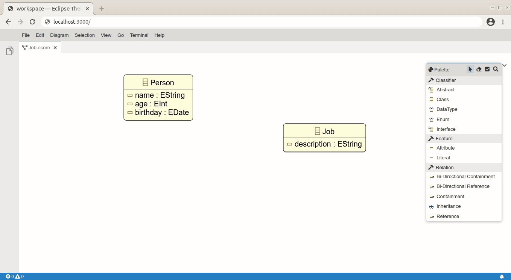

# ecore-glsp

For more information, please visit the [EMF.cloud Website](https://www.eclipse.org/emfcloud/). If you have questions, contact us on our [discussions page](https://github.com/eclipse-emfcloud/emfcloud/discussions) and have a look at our [communication and support options](https://www.eclipse.org/emfcloud/contact/).

Ecore GLSP provides a web-based editor for Ecore Models (including Diagrams), integrated with Eclipse Theia. It contains two components: one [GLSP](https://github.com/eclipse-glsp/glsp) language server (Server-side, written in Java), and one GLSP client extension to actually present the diagrams (Using [Sprotty](https://github.com/eclipse/sprotty-theia)). 

Ecore GLSP can display an existing Ecore model. The diagram layout will be persisted in an .enotation file next to the .ecore file. The diagram editor also supports creation of new elements (EClasses, EAttributes, EReferences...), as well as partial support for editing existing elements (Renaming, deleting...).

## Prerequisites

### Java
You need Java 11 to build the ecore-glsp editor.

## Getting started

Clone the ecore-glsp editor:

    git clone https://github.com/eclipse-emfcloud/ecore-glsp.git

Build server and client with the following build-script. This script also copies the needed server artifacts to the client.

    cd ecore-glsp
    ./build.sh

Run
  * Start the client as it is described in the [client README](client/README.md).
  * The copied backend artifacts are automatically launched on startup.
  * If you want to start the backends manually:
    * Execute the Java main classes: `org.eclipse.emfcloud.ecore.glsp.EcoreServerLauncher` and/or `org.eclipse.emfcloud.ecore.modelserver.EcoreModelServerLauncher`
    * On the client run `yarn start:debug` or the launch config `Start Browser Backend (expects running GLSP Server instance)`

## Building and deploying via Docker
The client repo contains a [Dockerfile](client/README.md), that builds the entire client application. The image listens on 0.0.0.0:3000 for incoming requests from a browser.

For installing docker locally please consult [docker's installation description](https://docs.docker.com/install/) for your OS.

### Locally build backend

Make sure to only build the backend (and not the front-end). This is needed before building the docker image.

`build.sh -b`

### Building docker image

Build the docker image using the following command, where &lt;imagename&gt; and &lt;tagname&gt; are replaced with the values you wish to use.
`docker build -t <imagename>:<tagname> .`

For example: `docker build -t ecore-glsp .`

### Running in docker

When the docker image is build, you can start the container using the following command (where again the &lt;imagename&gt; and &lt;tagename&gt; are replaced).

`docker run -it -p 3000:3000 --rm <imagename>:<tagname>`

For example: `docker run -it -p 3000:3000 --rm ecore-glsp`

After that you should be able to connect with your browser at http://localhost:3000.
